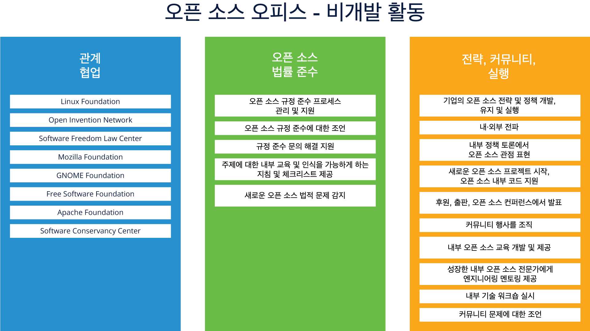
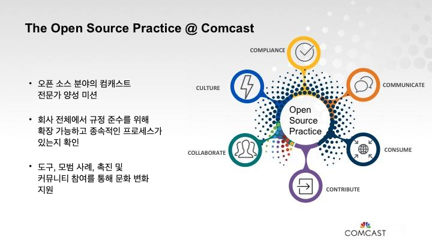

# 오픈 소스 프로그램 오피스(OSPO) 및 조직

## 소개

### 섹션 개요

이 섹션에서는 OSPO가 무엇을 구성하는지에 대한 정의와 설명을 제공하고 대규모 오픈 소스를 효과적으로 관리하는 데 도움이 되는 이 구성의 역할과 가치에 대한 정보를 제공합니다.

### 학습 목표

이 섹션이 끝나면 다음을 수행할 수 있습니다:

* OSPO(Open Source Program Office)가 무엇인지 정의
* 조직에서 OSPO의 역할 설명
* OSPO가 기업에 제공하는 가치를 명확히 합니다.

## 정의

### 오픈 소스 프로그램 오피스란 무엇입니까?

위의 소개 텍스트에서 언급했듯이 OSPO(Open Source Program Office)는 조직에서 오픈 소스 작업의 중심 연결점이 되도록 의도되었습니다. 그러나 그 정의는 (의도적으로) 가변성의 여지를 많이 남깁니다. 어떤 사람들은 그것이 가치를 감소시킨다고 말할 수도 있지만, 사실 OSPO가 조직에 따라 다르게 보일 수 있고 다르게 보일 수 있다는 사실은 실제로 장점입니다. 다양한 요구를 해결하기 위해 이 구성을 틀(그리고 자주 변경)할 수 있기 때문입니다. 오픈 소스 여정에 있을 것입니다.

예를 들어, 일부 조직에서는 제품 활성화에 필요한 변경 사항을 오픈 소스 프로젝트로 가져오기 위해 조직을 대신하여 작업하는 특정 개발자가 OSPO 내에서 대부분의 업스트림 오픈 소스 작업을 수행합니다. 그러나 일부 조직에서는 이러한 개발자가 분산되어 제품 개발 팀에 포함되어 OSPO 직원의 조언과 교육을 받습니다.

'일률적으로 적용되는' 모델은 없으며 OSPO는 대규모 리소스 집합이 있는 고도로 중앙 집중화된 것부터 조직 전체의 리소스 교육 및 영향력에 의존하는 작고 분산된 것까지 무엇이든 될 수 있습니다. OSPO가 무엇인지에 대한 훌륭한 개요 리소스는 [github 저장소](https://github.com/todogroup/ospodefinition.org)의 TODO 그룹 작업에서 찾을 수 있습니다.

### 기업에서 OSPO의 기능

오픈 소스 프로그램 사무국의 주요 기능은 전략적 우위를 위해 기업 내부에서 오픈 소스 사용, 기여 및 생성을 촉진하는 것입니다.

프로그램 오피스의 책임은 다양합니다. 여기에는 다음이 포함됩니다:

* 사내외 오픈소스 전략을 명확하게 전달
* 전략 실행을 소유 및 감독
* 상용 제품 및 서비스에서 오픈 소스의 효과적인 사용 촉진
* 오픈 소스 커뮤니티에 고품질의 빈번한 코드 릴리스 보장
* 개발자 커뮤니티에 참여하고 회사가 다른 프로젝트에 효과적으로 기여하는지 확인
* 조직 내 오픈소스 문화 조성
* 오픈 소스 라이선스 준수 검토 및 감독 유지

여기에서 모든 OSPO가 이러한 기능을 모두 갖고 있지 않거나 작업하는 작업을 반드시 균등하게 분배하지 않는다는 점을 반복하는 것이 중요합니다. 프로그램 오피스가 하는 일의 상당 부분은 조직의 비즈니스 요구 사항에 따라 달라집니다.

강조해야 할 한 가지는 OSPO가 개발자와 협력하는 것 이상을 수행한다는 것입니다. OSPO는 아래에 언급된 것처럼 지원할 수 있는 다양한 비개발 활동을 가지고 있습니다.

출처: TODO 그룹 OSPO 가이드([https://todogroup.org/guides/](https://todogroup.org/guides/))

### OSPO의 가치

성공적인 오피스는 개발자와 해당 팀을 지원하는 정책, 프로세스 및 지침을 수립하여 기업의 오픈 소스 사용에 큰 이점을 줄 수 있습니다. 표준 코딩 및 조직적 관행, 프로세스 및 도구 집합을 권장합니다. 동시에 프로그램 오피스는 창의적 개발자가 어쨌든 우회하거나 무시할 수 있는 불필요하고 경직된 프로세스를 피하거나 제거하여 프로젝트의 보안 및 기타 측면을 위협할 수 있습니다.

오픈 소스 프로그램 오피스는 사업부가 계획에서 오픈 소스를 고려하기 시작할 때 대화에 실체와 사실을 제공하므로 고려되는 이유, 결과가 무엇인지, 목표를 달성하기 위해 무엇이 필요한지 완전히 이해할 수 있습니다. 오픈 소스 전문가가 대화를 구성하는 데 도움을 줌으로써 이해 관계자는 결정을 내릴 때 어디서부터 시작하고 무엇을 생각할지 알 수 있습니다.

프로그램 오피스는 또한 발생하는 문제 또는 요구 사항을 해결하고 이해하기 위해 내부 개발자와 오픈 소스 사용자 커뮤니티 간의 중요한 연락 담당자 역할을 합니다. 프로그램 오피스는 법적 문제를 지원하고 개발자 옹호를 제공하며 회사의 오픈 소스 프로젝트를 기반으로 하는 외부 사용자의 목소리를 낼 수 있습니다. 프로그램 오피스는 또한 해당 정보를 제품 관리 팀을 포함한 회사 내부의 다른 사람들에게 전달하여 조직에 유익한 방식으로 제품을 더욱 발전시키는 데 도움을 줄 수 있습니다.

# 효과적인 오픈 소스 프로그램 오피스 구축

## 소개

### 섹션 개요

이 섹션에서는 역할, 거버넌스, 프로세스 및 구조에 대한 정보를 포함하여 효과적인 오픈 소스 프로그램 오피스를 만드는 방법을 보여줍니다.

### 학습 목표

이 섹션이 끝나면 다음을 수행할 수 있습니다:

* 새로운 OSPO를 구성하는 주요 단계를 설명합니다.
* OSPO의 일부가 될 수 있는 다양한 역할 및 구조 설명
* 거버넌스 및 기타 프로세스를 OSPO에 구축하는 방법을 명확히 합니다.

## OSPO 설립

### 어디서부터 시작해야 할까요?

모든 회사는 다르며 OSPO를 시작하는 데 필요한 요구 사항도 다릅니다. 프로세스는 최고 경영진의 동의를 받아 위에서 아래로 시작할 수 있습니다. 또는 아래에서 위로, 개발자와 오픈 소스 애호가의 주머니가 오픈 소스를 사용해 왔으며 공식화되기를 원하는 곳입니다.

법적 문제 및 보안에 대한 지침을 만들고자 하는 열망으로 나타날 수도 있고, 성숙하고 기업 리더의 관심을 끄는 풀뿌리 노력으로 시작할 수도 있습니다. 오픈 소스에 대한 헌신을 심화함으로써 회사를 발전시키고 가치를 추가하는 대의를 옹호하는 진취적인 CEO 또는 CTO와 함께 시작할 수도 있습니다.

이러한 종류의 합의와 경영진 지원은 견인력을 얻고 OSPO 시작 프로세스를 진행하는 데 필수적입니다. 오픈 소스 프로그램 오피스 여정을 시작하는 곳은 조직마다 다릅니다. 그러나 다음 페이지에서 고려해야 할 몇 가지 중요한 단계를 다룰 것입니다.

### 리더 찾기

계획 시작 방법에 관계없이 회사 내에서 신생 프로그램 오피스를 개발하고 운영하는 데 도움이 되는 적합한 리더를 찾는 것이 중요합니다. 최고 후보자는 기존 오픈 소스 프로젝트에서 개발자, 기여자 또는 커미터로 일하면서 기술적인 부분과 함께 오픈 소스 작동 방식에 대한 자세한 이해를 갖게 됩니다.

그들은 비즈니스 단위 전반에 걸쳐 전략과 계획을 알리는 데 도움이 되는 비즈니스 통찰력 및 관리 기술과 함께 회사 비즈니스에 대한 폭넓은 이해를 가지고 있어야 합니다. 그리고 다른 사람들에게 열정, 지식, 정보를 전달하고 오픈 소스 이니셔티브가 회사를 어떻게 변화시키고, 변화시키고, 개선할 것인지 이해하도록 도울 수 있도록 사교적이어야 합니다.

프로그램 사무국의 책임자는 사람들과 심층 기술에 대해 이야기할 수 있어야 하지만, 주요 업무는 세부적인 논의를 구성하는 데 도움을 주는 것이기 때문에 사용 중인 모든 기술의 안과 밖을 알 필요는 없습니다. 여러 이해 관계자 사이에서 발생합니다.

### 작업 정의

새로운 프로그램 오피스에 필요한 예산, 인력, 기술 도구 및 시스템도 운영을 확립하는 데 해결해야 할 핵심 문제입니다. 일부 회사는 시간제 관리자로 시작하지만 그 접근 방식을 통해서만 도달할 수 있다는 것을 알게 됩니다. 누군가의 자리를 정규직으로 만드는 것은 프로그램을 신속하게 유지하기 위한 소규모 지원 직원과 함께 프로그램을 시작하기 위한 확실한 단계입니다.

잘 정의된 오픈 소스 프로그램 오피스의 예로는 필요한 정책, 프로세스 및 도구를 추진하는 동시에 마찰이 있는 곳에서 마찰을 제거하고 간소화할 수 있는 것을 자동화하는 도구를 사용하고 필요한 작업을 위임하는 만트라를 운영하는 오피스가 있습니다. 달성하기 위해. 정책 및 프로세스를 설정하는 방법에 대한 자세한 내용은 향후 섹션에서 다루겠습니다.

프로그램 오피스는 구조화된 정책과 프로세스를 제공해야 하지만 유연성도 유지해야 합니다. 오픈 소스 사용자와 기여자가 도움이 필요할 때 오피스는 컨설팅처럼 운영되어 직원이 업무와 관련된 개인 또는 그룹 비즈니스 결정을 내릴 수 있도록 하는 동시에 지침을 제공합니다.

### 피드백 및 바이인 요청

오픈 소스 프로그램 오피스를 설립하는 것은 진공 상태에서 수행되어야 하는 일이 아닙니다. 비즈니스에서 중심적인 역할을 하므로 성공적으로 만들려면 기업 내부의 모든 관련 당사자로부터 공개적이고 정직한 입력과 피드백이 필요합니다. 경영진에서 개발자에 이르기까지 모든 사람이 생성에 대해 발언권을 갖도록 하면 광범위한 지원을 제공하는 데 도움이 됩니다.

회사가 오픈 소스로 하는 일을 파악하려면 조직이 진정으로 관심을 갖고 있는 핵심 사항에 대해 여러 이해 관계자의 생각이 필요합니다. 초기에 이 피드백을 찾고 OSPO에 대한 롤아웃 계획에 반영하도록 하면 프로그램이 정의하는 데 도움이 되는 프로세스 및 전략을 수용하고 성공하는 데 큰 도움이 될 것입니다.

## OSPO 프로그램 구조 정의

### OSPO는 어디에 있어야 합니까?

그렇다면 오픈 소스 프로그램 오피스는 회사의 조직 구조 내에서 어떻게 그리고 어디에 적합해야 할까요? 엔지니어링 부서에 있어야 합니까? 아니면 법무 부서, CTO 오피스 또는 다른 특정 사업부에 있습니까? 다시 말하지만, 이는 회사의 주요 비즈니스와 오픈 소스 전략에 따라 다릅니다.

여기에서 OSPO가 있어야 하는 위치에 대한 '일률적인' 답은 없다는 점을 다시 한 번 강조합니다. 다음 페이지에서는 프로그램 오피스를 위해 가장 자주 선택되는 위치에 대해 논의할 것이지만 이 목록이 완전한 것은 아닙니다.

### 법률 그룹의 일원인 OSPO

대규모 지적 재산 포트폴리오를 보유한 회사의 경우 오픈 소스 프로그램 오피스가 개발자가 발생하는 문제에 대해 법률 팀과 긴밀하게 협력할 수 있는 법률 오피스에 완벽하게 적합할 수 있음을 의미할 수 있습니다. IP 관련 법적 문제가 발생할 가능성을 항상 우려하기 때문에 하드웨어 회사에 적합할 수 있습니다.

그러나 이 접근 방식의 한 가지 문제는 법무 부서의 OSPO가 시간의 상당 부분을 규정 준수 문제에 집중할 수 있다는 것입니다. 장기적으로 조직. 법무 그룹에서 OSPO를 호스팅하기로 결정했다면 그룹 역할의 규정 준수 측면과 오픈 소스 커뮤니티 참여에 대한 보다 진취적이고 전략적인 정책의 균형을 맞출 수 있는 강력한 리더가 필요합니다.

### 엔지니어링 OSPO

엔지니어링 중심의 회사는 종종 엔지니어링 부서 내에서 오픈 소스 프로그램 오피스를 유지하기로 선택합니다. 이를 통해 개발자가 작업에서 보다 효과적이고 생산적인 작업을 수행하는 데 직접 노력을 집중할 수 있습니다.

대부분의 경우 이러한 프로그램 오피스는 CTO 또는 경우에 따라 CIO에게 보고합니다. 강력하고 연결된 제품 세트가 있는 조직에서 오피스는 제품 개발 부사장 또는 엔지니어링 부사장에게 보고할 수 있습니다. 제품 포트폴리오가 서로 다른 회사에서는 일반적으로 OSPO를 CTO 오피스에 두는 것이 가장 좋습니다. OSPO는 모든 엔지니어링 팀을 위한 정책 및 교육 노력을 개발하는 데 가장 폭넓은 관점과 권한을 제공하기 때문입니다.

이 접근 방식의 한 가지 단점은 잠재적으로 규정 준수 활동에 덜 집중할 수 있지만(법률 그룹과 함께 OSPO를 호스팅하는 것과 비교할 때) 강력한 리더가 여기에 필요한 균형을 제공할 수 있으며, 이것이 잘 수행되면 개발자가 프로세스가 가볍고 번거롭지 않다고 느끼는 경우 규정 준수를 높일 수 있습니다.

### 개발자 관계/마케팅의 일부인 OSPO

일부 조직의 경우 오픈 소스 오피스는 오픈 소스를 사용하여 구축한 제품 판매를 목표로 하는 잠재 고객을 유입시키기 위해 오픈 소스를 사용하기 때문에 마케팅 그룹 내에 있습니다. 조직에서 주요 오픈 소스 개발자 및 프로젝트와의 긴밀한 연결이 필요한 경우 개발자 관계와 같은 그룹에서 OSPO를 호스팅하면 이러한 지원을 제공할 수 있습니다.

물론 OSPO는 필요에 따라 규정 준수 및 교육 영역에서 필요한 다른 역할을 수행할 수 있어야 합니다.

### 구현 고려 사항

조직에서 OSPO를 배치할 위치를 결정할 때 고려해야 할 또 다른 중요한 요소는 중앙 집중식 접근 방식과 분산 접근 방식을 계획하는지 여부와 관련이 있습니다.

소규모 조직에서는 소비, 협업 및 생성을 위한 모든 워크플로가 중앙 위치에 있는 중앙 집중식 오픈 소스 프로그램 오피스를 갖는 것이 효과적일 수 있습니다. 접근 방식과 규정 준수의 일관성을 최대한 보장하지만 조직이 성장함에 따라 다루기 어려워질 수도 있습니다.

중앙 집중식 조직은 조직을 대신하여 업스트림 오픈 소스 프로젝트에 기여할 주요 개발자를 호스트하기도 합니다. 이러한 개발자는 종종 자체적으로 오픈 소스 프로젝트에 기여할 수 있는 교육과 전문 지식이 부족한 제품 팀의 내부 컨설턴트 역할을 합니다.

조직이 충분히 커지면 일반적으로 분산 접근 방식이 가장 잘 작동합니다. 개발자와 관리자가 전체 조직 정책과 일치하는 오픈 소스에 대한 제품별 결정을 내릴 수 있도록 교육 및 컨설팅 리소스를 제공하는 데 집중할 수 있기 때문입니다. 이 접근 방식은 또한 조직 전체에 오픈 소스 지식을 전파하고 보다 개방적이고 협력적인 문화를 조성하는 데 도움이 됩니다. 이는 더 큰 오픈 소스 생태계와 협력하는 데 중요한 특성입니다.

이 모듈의 뒷부분에서 사례 연구를 공유하여 다른 조직에서 이러한 구조적 결정을 내린 방법에 대한 몇 가지 예를 제공합니다.

## 수업: OSPO 역할

### 관리 역할

오픈 소스 프로그램 오피스를 만들 때 오픈 소스 프로그램 관리자, 회사 법무팀, 엔지니어와 임원으로 구성된 모든 검토 위원회의 역할과 책임을 설정하기 위한 결정이 내려져야 합니다. 또한 OSPO가 성장함에 따라 조직에 가치를 제공하는 추가 역할이 있을 수 있습니다. 다음 몇 페이지에서 이러한 역할에 대해 더 자세히 다룰 것입니다.

#### 프로그램 관리자

최대 효과를 위해 프로그램 관리자는 오픈 소스 활동에 대한 회사의 이익을 직접 감독하고 직접 관리하는 임원급 직책으로 권한을 부여받아야 합니다. 이는 기업 내부에서 오픈 소스 목표와 비전을 향해 나아가는 데 필요한 도구를 제공할 것입니다.

일부 회사는 검토 위원회와 유사한 오픈 소스 집행 위원회를 사용하기로 선택합니다. 이러한 그룹은 일반적으로 회사 내 모든 주요 사업부의 고위 리더로 구성되며 정책 변경 및 도입에 대한 이사회 스타일 지침을 제공하고 오픈 소스 프로그램의 우선 순위를 설정하며 조직 행동의 변화를 주도하도록 지원합니다.

#### 법무

회사 내의 다른 모든 기능과 마찬가지로 법무팀은 법률, 오픈 소스 라이선스 계약 및 기타 법적 세부 사항을 준수하도록 오픈 소스 프로그램 오피스 운영에 대해 발언권을 가져야 합니다. 오픈 소스와 관련하여 법무팀은 회사가 내부적으로 코드를 사용하고 수용 가능한 조건으로 프로젝트에 다시 기여할 수 있도록 보장할 책임이 있습니다.

규모가 큰 조직은 오픈 소스 프로그램에 자문을 제공할 전담 변호사를 고용하거나 교육하는 것을 고려해야 합니다. 그러나 지식이 풍부한 시간제 직원이나 외부 고문을 사용할 수도 있습니다. 오픈 소스 라이선스 및 IP에 대한 지식과 경험이 풍부한 변호사와 협력하는 것은 상업 계약이나 표준과 관련하여 전문적이고 때로는 당혹스러운 법적 영역이 될 수 있기 때문에 종종 도움이 됩니다.

#### 준법감시팀

오픈 소스 준수 팀은 오픈 소스 라이선스 준수를 보장하는 임무를 맡은 다양한 개인으로 구성된 학제 간 그룹입니다. OSRB(Open Source Review Board)라고 하는 핵심 팀은 엔지니어링 및 제품 팀 대표, 한 명 이상의 법률 고문, 규정 준수 담당자(종종 오픈 소스 프로그램 관리자임)로 구성됩니다.

확장된 팀은 규정 준수 노력에 지속적으로 기여하는 여러 부서의 다양한 개인으로 구성됩니다. 여기에는 문서, 공급망, 기업 개발, IT, 현지화 및 OSEC(오픈 소스 집행 위원회)가 포함될 수 있습니다. 그러나 핵심 팀과 달리 확장 팀의 구성원은 OSRB에서 받은 작업에 따라 시간제로만 규정 준수 작업을 수행합니다.

#### 개발자 관계, 변호 및 전도사

오픈 소스 개발자 관계 및 전도자는 특정 프로젝트에 대한 회사의 개발자 커뮤니티 내에서 관심과 열정을 구축하기 위해 일할 수 있기 때문에 신생 오픈 소스 프로그램 오피스에서 중요할 수 있습니다. 전도사들은 종종 컨퍼런스와 기술 행사에 참석하여 청중들이 오픈 소스 커뮤니티와 기업 경험을 공유하면서 어떻게 사용할 수 있고 어떤 도전과 기회를 제공하는지 이해하는 데 도움이 되는 오픈 소스가 무엇인지 설명합니다.

#### 기타

또한 도구 관리자, 교육 관리자, 도구 및 시스템 통합 개발자, 배포 지원 직원 및 구현 프로젝트 리더를 포함하여 오픈 소스 프로그램 오피스의 성공을 위해 다른 직무 역할을 만드는 것이 중요합니다. 예를 들어 도구 관리자는 오픈 소스 프로젝트에서 작업하는 엔지니어에게 필요한 도구를 선택, 제공 및 통합하는 동시에 도구가 기업의 라이선스 및 기타 요구 사항을 충족하는지 확인하는 데 도움이 필요합니다.

## OSPO 프로세스 정의

### 개요

OSPO의 구조 및 인력 요구 사항을 해결한 후 다음 단계는 회사의 오픈 소스 전략을 일관되게 구현할 수 있도록 잘 정의된 정책 및 프로세스를 개발하는 것입니다.

정책은 회사 전체에서 오픈 소스로 작업하기 위한 요구 사항과 규칙을 제시해야 하며, 일상적으로 규칙을 준수하도록 보장하는 문서화되고 실행 가능한 프로세스를 제시해야 합니다.

결정적으로 이러한 프로세스에는 최소한의 오버헤드가 필요하고 기존 오픈 소스 정책 및 프로세스를 검토할 때 반복적으로 제거, 자동화 및 위임하여 절차를 간소화하기 위해 규칙에 대해 지속적으로 질문하고 업데이트해야 합니다. 이는 정책이 적용되는 이유와 사용자를 위해 개선할 수 있는 방법을 묻는 것을 의미합니다.

이러한 규칙이 오픈 소스 프로그램 오피스를 위해 신중하게 만들어졌더라도 기업은 비즈니스가 변화하고 오픈 소스 참여가 성숙하고 성장함에 따라 필요에 따라 규칙과 절차를 발전시키고 수정할 준비가 되어 있어야 합니다.

### 물어볼 질문

오픈 소스 정책 및 프로세스의 초안을 작성할 때 논의해야 하는 많은 주제는 다음과 같습니다:

* 회사 직원이 오픈 소스 프로젝트에 기여할 수 있는 방법
* 회사가 내부 프로젝트를 오픈 소스로 만들 수 있는 방법
* 회사가 오픈 소스 프로젝트에 대한 외부 기여를 수락하는 방법
* 오픈 소스 출시 준비 방법
* 승인을 받는 방법
* 개발자가 GitHub 및 기타 코드 저장소에서 찾은 오픈 소스 코드를 사용하는 방법
* 오픈 소스 코드를 회사에 가져올 수 있는 방법을 설명하는 절차 및 규칙
* 다른 사람들이 사용 중임을 알 수 있도록 수신 코드를 카탈로그화하는 방법
* 회사 주변에서 같은 생각을 가진 외부 개발자 커뮤니티를 성장시켜 계속해서 번창할 수 있는 방법
* 코드가 언제 오픈 소스로 공개되어야 하는지 또는 지적 재산으로 유지되어야 하는지 결정하는 데 도움이 되는 규칙

이러한 질문에 대한 답변은 향후 정책 및 프로세스에 대한 정보를 제공하는 데 도움이 됩니다. 다음 페이지에서 이러한 정책의 몇 가지 예를 다룰 것입니다.

### 코드 공개 정책

OSPO의 중요한 목표는 개발자가 오픈 소스 프로젝트에 성공적으로 기여하고 자신의 프로젝트를 출시하도록 돕는 것입니다. 지침과 체크리스트를 통해 개발자는 라이선스 또는 기밀 문제 없이 코드를 오픈 소스로 릴리스하는 데 필요한 모든 것을 확보할 수 있습니다. 특히 새로운 기여자의 경우, 기여하기 전에 피드백을 얻을 수 있는 안전한 장소로 내부 검토 프로세스를 사용할 수 있도록 하는 데 도움이 될 수 있습니다.

조직은 또한 "업스트림 우선" 개발 정책을 채택하기 위해 노력해야 합니다. 먼저 업스트림 오픈 소스 프로젝트에 패치를 제출하고 자체 제품 다운스트림에 패치를 통합하면 각 릴리스 후 리엔지니어링에 막대한 시간과 비용을 소비하는 것을 피할 수 있습니다.

### 기여 수락 정책

결국 자신만의 오픈 소스 프로젝트를 만들고 중립적인 기반에서 호스팅되지 않는 경우 회사에서 외부 개발자로부터 이러한 프로젝트에 대한 기여를 받는 절차를 만들고 싶을 것입니다.

그것은 물론 회사의 오픈 소스 코드를 다른 커뮤니티에 공개하고 다른 개발자가 자신의 프로젝트에 관심을 갖도록 초대하는 이점 중 하나입니다. 공식적으로는 직원이 아니더라도 훌륭한 사람들이 전 세계에서 회사 코드를 작업하도록 하여 회사를 개선하고 기능을 확장할 수 있기 때문입니다. 이러한 종류의 협업은 회사에 중요하며 많은 오픈 소스 프로그램 오피스에서 공통적으로 초점을 맞추고 있습니다.

### 입양 촉진 정책

당신은 또한 다른 사람들이 그들의 제품과 서비스에서 당신의 코드를 사용하도록 장려하고 싶을 것입니다. 이는 오픈 소스 프로젝트의 성장 및 유지에 도움이 되는 생태계 구축의 핵심입니다. 오픈 소스 사용을 위한 정책은 다양한 혁신적인 형태로 나타날 수 있습니다.

예를 들어 RedHat은 대부분의 경우 처음부터 새로 생성된 코드로 오픈 소스를 기본으로 하는 고유한 정책을 가지고 있습니다. 즉, 회사 내에서 각 소프트웨어를 개발할 때 향후에는 오픈 소스로 출시될 예정이라고 가정합니다.

이러한 면밀한 조사로 인해 개발자는 오픈 소스를 작성할 때 더 나은 방식으로 구조화하는 경향이 있으며, 작업에서 코드 종속성이 더 적거나 개선된 더 깨끗한 코드를 생성합니다.

### 내부 소비 정책

기타 필요한 정책에는 팀이 오픈 소스 소프트웨어 사용 및 생성을 위한 신뢰할 수 있는 소스를 찾는 방법과 위치에 대한 규칙, 코드 관리 및 유지 관리 절차 설정에 대한 정책, 프로젝트에 대한 커뮤니티 상호 작용 공식화에 대한 규칙이 포함됩니다.

오픈 소스 사용 정책은 제품 기반에 들어가는 모든 소프트웨어(독점, 제3자 또는 오픈 소스)가 감사, 검토 및 승인되었음을 보장합니다. 또한 제품이 고객에게 제공되기 전에 다양한 소프트웨어 구성 요소를 사용하여 발생하는 라이선스 의무를 회사에서 이행할 계획을 가지고 있는지 확인합니다.

예를 들어, 정책에 따라 엔지니어가 제품에 오픈 소스 코드를 통합하기 전에 OSRB(오픈 소스 검토 위원회)와 같은 조직의 감사 직원으로부터 승인을 받아야 할 수 있습니다. 또한 제3자로부터 받은 소프트웨어는 포함된 모든 오픈 소스 코드를 식별하기 위해 감사해야 한다고 명시할 수 있으며, 이는 제품이 배송되기 전에 라이선스 의무가 이행될 수 있음을 보장합니다.

### 라이선스 준수 정책

또한 법률 준수 절차를 공식화 및 확립하고 프로그램에 대한 경영진의 감독을 보장하는 정책이 필요합니다.

또한 개발자와 기여자를 위한 절차를 자동화하고 간소화하여 규정 준수 및 코드 테스트 작업의 대부분을 가능하게 하는 소프트웨어 도구를 처리하는 방법을 계획하고 싶을 것입니다. 규정 준수 도구에 대한 자세한 내용은 이 시리즈의 이후 과정 모듈에서 다룹니다.

기존 오픈 소스 리소스는 기여자 라이선스 계약(CLA; Contributor License Agreements)에 대한 문서를 포함하여 오픈 소스 프로젝트에 필요한 다른 자료를 찾기 위한 잠재적인 금광이기도 합니다. CLA는 일반적으로 오픈 소스 라이선스에 따른 소프트웨어인 "지적 재산이 회사/프로젝트에 기여한 조건을 정의"하는 데 사용됩니다. CLA를 사용하는 프로젝트는 기여자가 프로젝트에서 수락되기 전에 기여자 및 종종 그들의 회사가 CLA에 서명해야 합니다. CLA 사용 및 서명에 대한 회사의 정책을 결정하는 것은 전체 라이선스 준수 정책을 구축할 때 고려해야 할 중요한 단계입니다.

### 마지막 말

회사에서 오픈 소스 프로그램 오피스를 만들기로 결정할 때 해야 할 일이 많고 고려해야 할 사항이 많지만 그 가치는 이를 달성하기 위해 들인 노력보다 클 것입니다. 프로그램 오피스 이니셔티브를 추진할 적합한 리더를 찾는 것은 성공을 위한 과정에서 중요한 단계입니다.

OSPO의 핵심은 실제로 문화 변화 노력이라는 것을 기억하는 것도 중요합니다. 분명히 소프트웨어가 중요한 역할을 하지만 회사의 현재 문화와 오픈 소스에서 가고자 하는 방향을 이해하는 것이 매우 중요합니다. OSPO의 모든 프로세스 및 교육 부분에 대해 대부분의 조직이 가장 크게 깨닫는 것은 이 프로그램과 그 리더가 조직 내에서 실제로 변화를 일으키는 주체라는 것입니다.

# 추가 정보 및 사례 연구

## 소개

### 섹션 개요

이 섹션에서는 오픈 소스 프로그램 오피스를 구축한 조직의 사례 연구를 제공하고 보다 효과적인 오픈 소스 프로그램 관리를 위해 OSPO를 만드는 과정을 시작할 때 도움이 될 추가 정보에 대한 포인터를 제공합니다.

### 학습 목표

이 섹션이 끝나면 다음을 수행할 수 있습니다.

* 여러 오픈 소스 프로그램 오피스 구현 간의 주요 차이점 설명
* 자신의 OSPO 구축에 대한 추가 정보를 보려면 어디로 가야 하는지 알아두십시오.

## 사례 연구

### 개요

앞서 언급했듯이 모든 조직의 오픈 소스 프로그램 오피스는 다를 수 있습니다. 이는 서로 다른 비즈니스 모델의 현실과 각 조직의 현재 오픈 소스 성숙도 및 인식 상태를 반영합니다.

합리적으로 광범위한 관점을 제공하기 위해 사례 연구로 세 회사와 OSPO 생성 여정을 선택했습니다. 이 조직들은 오픈 소스로의 여정을 시작하는 다른 사람들에게 도움이 되기를 바라며 이러한 사례 연구를 구축하기 위해 오픈 소스 리더와 관리 팀의 시간을 기꺼이 기부했습니다.

사례 연구의 출처:

* **컴캐스트**
* **마이크로소프트**
* **Salesforce**

이 연구에서는 도구, 조직 및 측정항목에 대한 다양한 접근 방식을 볼 수 있습니다. 이 연구는 TODO 그룹(Linux Foundation Initiative)의 후원 하에 수행되었으며 이 모듈의 뒷부분에서 추가 정보에 대한 포인터를 제공합니다.

### 컴캐스트

오픈 소스에 대한 Comcast의 참여는 시간이 지남에 따라 진화한 점진적인 과정이었습니다. 회사는 결국 두 개의 오픈 소스 프로그램 오피스를 만들었습니다. 하나는 NBC 비즈니스용이고 다른 하나는 이 프로필의 주제인 비즈니스의 케이블 측용입니다.

Comcast는 최고 소프트웨어 설계자인 Jon Moore가 Apache HTTP에 패치를 기고한 2006년경에 오픈 소스에 기여하기 시작했습니다. 그는 관리 팀에게 패치를 별도로 유지 관리하는 것보다 메인 프로젝트에 통합하는 것이 더 비용 효율적이라는 것을 보여주었습니다.

Moore는 학제간 팀과 협력하여 법률 및 기술 주제 전문가로 구성된 오픈 소스 자문 위원회를 구성했습니다. 그들은 기여를 검토하고 훌륭한 오픈 소스 관행과 커뮤니티 구축에 중점을 둔 내부 지침을 만들었습니다. 2013년에 이러한 기여를 추적하기 시작했을 때 13개가 있었습니다. 올해에는 거의 10배에 달하는 것을 할 계획입니다.

*"회사가 오픈 소스 관행을 확립할 때 우리는 오픈 소스에 대해 진지하며 이에 투자하고 싶다는 큰 메시지를 보냅니다."* – Nithya Ruff, Comcast의 Open Source Practice 수석 이사.

### 6C의 오픈 소스 프로그램 실습

2016년 Comcast는 Ruff를 고용하여 점점 더 중요한 오픈 소스 전략을 이끌었습니다. 이 관행은 질문을 제기하고 직원을 교육하며 인식을 제고하는 조직을 원하는 Comcast 리더십 팀의 최고 수준의 지원을 받았습니다.

오픈 소스 프로그램 실무에는 3명의 정규 직원(2020년 6월 기준)이 있으며 법률, 엔지니어링, IT, PR 등의 기능 전문가에게 의존하여 프로그램을 확장할 수 있습니다. 목표는 직원을 지도하고, 안내하고, 조언하고, 추천하고, 컨설턴트로 봉사하는 것입니다. Ruff는 소비, 기여, 규정 준수, 커뮤니케이션, 협업 및 역량 구축과 같은 "6C"로 오픈 소스 관행의 기능을 요약합니다.

오픈 소스 관행에는 두 가지 주요 목표가 있습니다.

1. 사내 사람들이 오픈소스로 작업하기 쉽게 만든다. 오픈 소스의 사용, 오픈 소스에 대한 기여 또는 커뮤니티, 재단 및 조직과의 협업이든, 목표는 법적, 프로세스, 도구, 커뮤니케이션 및 인식 장벽을 제거하는 것입니다.

2. 오픈 소스 및 기술 커뮤니티에서 외부에서 볼 수 있습니다. 많은 사람들은 Comcast가 수천 명의 개발자가 있는 기술 회사라는 사실을 모르기 때문에 인지도를 높이고 자신이 하는 일을 공유하고자 합니다.

### 오픈 소스 기여

Comcast는 OpenStack과 같은 기존 오픈 소스 커뮤니티에 크게 기여할 뿐만 아니라 [몇 가지 프로젝트를 오픈 소스화](https://github.com/Comcast)했습니다. [Apache Traffic Control](https://trafficcontrol.incubator.apache.org/)은 Comcast 내에서 시작되었으며 현재 인큐베이션 중인 Apache Software Foundation에 기부되었습니다.

그들은 또한 셋톱 박스에 대한 표준을 만드는 데 초점을 맞춘 [RDK 관리 프로젝트](http://rdkcentral.com/)라는 독립 컨소시엄을 설정하는 데 중요한 역할을 했습니다. RDK 소프트웨어는 Yocto 빌드 시스템을 사용하여 반도체 공급업체부터 OEM 및 ISV에 이르기까지 체인의 모든 사람이 일관된 시스템과 구조를 사용하여 셋톱 박스 및 유사 장치용 콘텐츠를 구축할 수 있도록 일관된 계층을 생성합니다.

Comcast는 인터넷 속도를 측정하는 방법의 측면에서 세상에 투명하기를 원했기 때문에 인터넷 속도 테스트인 [Speed-TestJS 도구](https://github.com/Comcast/Speed-testJS)를 공개했습니다. 속도. 또한 이 프로젝트를 통해 사람들은 도구를 직접 사용하여 Comcast가 약속한 것을 제공하고 있다는 느낌을 받을 수 있습니다. 이것은 개방의 결과로 더 많은 신뢰를 생성할 수 있는 도구의 좋은 예입니다.

프로젝트에 기여하는 것 외에도 Comcast는 [Cloud Foundry Foundation](https://www.cloudfoundry.org/membership/) , [Apache Software Foundation](https://www.apache.org/) , [리눅스 재단](https://www.linuxfoundation.org/membership/) , [Yocto 프로젝트](https://www.yoctoproject.org/) , [Linaro](https://www.linaro.org/) , [OpenStack Foundation](https://www.openstack.org/foundation/) , [오픈 네트워크 자동화 플랫폼(ONAP)](https://www.onap.org/) 및 [OpenDaylight](https://www.opendaylight.org/) 같은 여러 단체의 회원사입니다.

이러한 기여를 통해 Comcast는 오픈 소스 커뮤니티에 참여함으로써 얻게 되는 선의의 혜택을 받았습니다. Comcast의 기여는 회사가 새로운 개발자를 모집하는 데에도 도움이 되었습니다. 오늘날 개발자들은 훌륭한 오픈 소스 시민인 회사에서 일하기를 원하며 다양한 커뮤니티에서 Comcast의 기여는 오픈 소스에 대한 헌신에 대해 진지하다는 것을 보여줍니다.

### 비즈니스와 연계

> "관행 확립, 재단 수준에서의 가시적인 참여, 기여도 증가, 리더십 지원 및 회사로서의 도구 지원으로 인해 오픈 소스를 쉽게 수행할 수 있습니다." – Nithya Ruff, Comcast의 Open Source Practice 수석 이사.

회사의 오픈 소스 전략이 비즈니스 전략과 밀접하게 일치하는지 확인하는 것이 중요합니다. 오픈 소스 오피스는 회사의 목표를 진정으로 이해하고 오픈 소스 전략에서 이를 가능하게 해야 합니다. 이러한 전략적 연계를 통해 오픈 소스 관행이 Comcast의 광범위한 회사 목표와 연계되어 관행과 회사 전체의 장기적인 성공을 장려할 수 있습니다.

### 마이크로소프트

마이크로소프트는 이제 오픈 소스 공간에서 인정받는 거대 기업이지만 불과 몇 년 전만 해도 소프트웨어 거물이 그런 역할을 한다는 것은 상상할 수 없는 일처럼 보였습니다. 따라서 많은 사람들은 Microsoft가 독점 소프트웨어 제조업체로 시장 주도권에서 벗어나 오픈 소스로 크게 이동했을 때 놀랐습니다. 이 회사의 스토리는 주목할 만하지만 오픈 소스 여정은 예상보다 갑작스러웠고 예상하지 못했습니다.

> "인식에도 불구하고 Microsoft는 꽤 오랫동안 오픈 소스를 수행해 왔습니다. 처음에는 여기저기서 실험적인 부분이었지만 약 6년 전인 2011년에 Microsoft Open Technologies라는 단체에서 그 많은 부분에 초점을 맞췄습니다. "라고 Microsoft의 오픈 소스 프로그램 오피스 이사인 Jeff McAffer가 설명했습니다.

### 본격적으로 오픈 소스

그때부터 마이크로소프트가 오픈 소스로 무엇을 할 수 있는지에 대한 탐색이 본격적으로 시작되었다고 McAffer는 말했습니다. 초기에는 회사에서 오픈 소스로 무엇이든 하는 데 관심이 있는 사람이 있으면 중앙 그룹에 와서 관련 오픈 소스 개발자, 기여자 및 유지 관리자의 도움을 받았습니다.

약 3년 전, 상황이 바뀌기 시작했습니다. Microsoft는 회사 전체에 오픈 소스를 보급하기로 결정하고 주요 엔지니어링 그룹에 오픈 소스를 적용했습니다.

> "이것이 우리가 한 일의 전부였다면 우리가 오픈 소스를 수행하는 방식에 대해 견딜 수 없는 공백을 남겼을 것입니다."라고 McAffer는 말했습니다. “누군가는 정책과 모든 오픈 소스 노력을 조정하는 방법, 사용할 프로세스와 도구, 프로젝트를 추적하는 방법 등에 대해 생각해야 합니다. 그래서 모든 문제를 처리하기 위해 우리는 현재 오픈 소스 프로그램 오피스로 알려진 것을 만들었습니다."

초기 오픈 소스 그룹의 기술 인력 중 일부는 새로 구성된 프로그램 오피스로 이동했고 다른 일부는 자신의 작업과 관련된 엔지니어링 그룹에 합류했습니다. 마이크로소프트는 모든 프로젝트와 프로세스가 완전히 사람이 되었는지 확인하기 위해 추가 인력이 필요했고, 따라서 내부 및 외부의 채용 노력이 곧 진행되고 있었습니다. 오늘날 오픈 소스는 Microsoft의 글로벌 작업에서 번창하는 부분입니다.

### 비즈니스 및 프로그래매틱 목표

Microsoft에는 중앙 오픈 소스 전략이나 중앙 승인 기관이 없습니다. 대신 오픈 소스 프로그램 사무국은 회사 전체에서 이러한 논의와 결정을 용이하게 합니다. 팀은 여전히 ​​오픈 소스 참여를 검토해야 하지만 더 로컬에서 수행됩니다.

> "그들은 자신의 비즈니스를 알고, 기술적 상호 작용이 어떻게 작동하기를 원하는지, 생태계 측면에서 추진하고자 하는 위치, 발생해야 하는 모든 다양한 뉘앙스를 이해합니다."라고 McAffer는 말했습니다.

> "우리는 이러한 결정과 지시의 대부분을 현지 경영진에게 맡기지만 그러한 결정과 지시에 대해 생각할 수 있는 구조를 그들에게 제공합니다. 우리는 IP를 관리하는 방법과 보안 문제에 대해 수행하는 작업에 대한 중앙 정책을 가지고 있습니다. 우리는 일관성 있고 구체적인 방식으로 매우 간단하게 실행할 수 있도록 이러한 정책을 구현하는 도구와 프로세스를 제공하십시오."

### 관리 도구

Microsoft의 정책은 워크로드를 처리하기 위해 그에 따라 도구가 사용되는 프로세스로 요약됩니다. 한 가지 예는 오픈 소스 릴리스입니다. 정책의 문제로 릴리스는 GitHub에서 이루어집니다.

> McAffer는 "GitHub에서 우리의 존재를 둘러싸고 많은 도구를 사용하고 있으며 약 100개 조직에서 10,000개 이상의 리포지토리를 관리하고 약 12,000명의 Microsoft 직원이 해당 공간에서 상호 작용합니다."라고 말했습니다.

> "그것은 다양한 측면을 관리하는 시스템이 정말로 필요한 규모입니다. 예를 들어 사람들이 우리가 실행하는 프로젝트 중 하나에 기여하기를 원할 때 기여자 라이선스 계약 또는 CLA를 관리하는 데 도움이 되는 도구가 필요합니다. 이러한 모든 작업을 위해 우리는 솔루션을 직접 구축하거나 오픈 소스 솔루션으로 전환했습니다." 예를 들어, Microsoft는 CLA 관리를 위해 SAP가 만든 오픈 소스 프로그램인 [CLA Assistant](https://cla-assistant.io/)를 사용합니다.

> "GitHub 관리 측면에서 우리는 GitHub에서 기업 존재를 관리하는 데 도움이 되는 기존 도구 세트가 없었기 때문에 다른 방향으로 이동했습니다."라고 McAffer는 말했습니다. "그래서 우리는 GitHub에서 오픈 소스로 사용할 수 있는 현재 [오픈 소스 포털](https://github.com/Microsoft/opensource-portal)이라고 하는 것을 만들었습니다."

그 요소는 [opensource.microsoft.com](https://opensource.microsoft.com/) 에서 쉽게 볼 수 있지만 Microsoft 직원이 저장소와 팀을 관리하는 내부 측면도 있습니다.

> "우리는 소스를 공개했으며 다른 회사에서 이를 선택하여 내부적으로 사용하고 있으므로 양방향입니다."라고 McAffer는 설명했습니다.

GitHub는 많은 상호 작용이 가능한 매우 풍부한 환경입니다. 많은 회사와 마찬가지로 Microsoft는 모든 일이 진행되고 있는지 추적하고 저장소에서 무슨 일이 일어나고 있는지 이해하는 데 어려움을 겪고 있었습니다.

> "우리는 결국 GHTorrent 프로젝트에 참여하게 되었습니다. 우리는 그들과 꽤 많은 일을 했고 실제로 이제 GHTorrent 프로젝트를 후원하고 있으므로 [GHTorrent.org]에서 볼 수 있는 모든 Azure 리소스에 대한 비용을 지불합니다. http://ghtorrent.org/)"라고 말했다.

GHTorrent는 Microsoft가 GitHub에서 진행 중인 일을 이해하는 데 도움이 될 뿐만 아니라 자체 프로젝트 측면에서도 내부적으로 이해하도록 도와줍니다. 그럼에도 불구하고 개인 리포지토리 작업 및 관리자 권한이 필요한 팀과 관련된 보다 자세한 데이터를 포함하여 GHTorrent가 설정하지 않은 작업이 있습니다.

회사는 결국 [GHCrawler](https://github.com/microsoft/ghcrawler) 라는 또 다른 시스템을 만들었습니다. 이 시스템도 오픈 소스로 제공됩니다. 이 도구는 커밋 수준, 팀 및 권한 변경 사항까지 GitHub의 모든 것을 추적합니다. 그런 다음 해당 데이터는 메트릭 및 추적 분석에 사용되어 얼마나 많은 pull 요청이 들어오는지, 조치를 취하는 속도, 닫거나 병합하는 데 걸리는 시간과 같은 통찰력을 발견합니다. McAffer는 "이는 우리의 존재를 추적하는 방법을 제공합니다.

### 오픈 소스 사용 간소화

오픈 소스의 사용은 Microsoft에서 완전히 다른 문제이며 다른 프로세스입니다. 회사는 오픈 소스를 무수히 활용하고 있으며, 이를 모두 추적하고 법적 보안 측면을 관리해야 할 필요성이 엄청납니다.

> "우리는 오픈 소스 사용과 관련된 프로세스와 정책을 단순화하고, 책임 있는 오픈 소스 소비자가 되는 주요 속성을 제대로 이해하고, 올바르게 수행하는 방법을 확인하기 위해 엄청난 양의 작업을 수행했습니다. 라이센스에"라고 McAffer가 말했습니다.

> "이를 위해 우리는 내부에서 진행 중인 일을 발견, 추적 및 모니터링하고 오픈 소스 사용에 대해 보고하는 많은 도구를 내부적으로 작성했습니다."라고 그는 말했습니다. 이러한 도구는 Microsoft의 엔지니어링 시스템과 긴밀하게 통합되어 있기 때문에 다소 독점적인 경향이 있습니다.

> "우리는 이를 공개 소스 커뮤니티에서 더 광범위하게 사용할 수 있는 방법을 찾으려고 노력했지만 비즈니스 정책이나 엔지니어링에 여러 면에서 매우 구체적이기 때문에 조금 어려웠습니다. 다른 사람의 시스템과 같지 않을 것입니다."라고 McAffer가 말했습니다.

Microsoft 오픈 소스 여정은 수년 동안 흥미로운 여정이었고 진정한 오픈 소스 정신에서 우리는 도구에서 코드에 이르기까지 그 과정에서 우리가 배운 것을 모든 사람과 계속 공유할 것입니다.

### Salesforce

Salesforce는 오픈 소스 프로젝트가 소프트웨어 성공에 관심을 갖고 있는 다양한 이해 관계자 커뮤니티가 있을 때 건전한 상태를 유지한다는 것을 일찍부터 배웠습니다.

[Apache Phoenix](https://phoenix.apache.org/)는 자체 오픈 소스 피닉스 프로젝트로 Salesforce에서 시작되었습니다. 그러나 Salesforce 외부의 사람들도 투자하고 프로젝트가 더 이상 한 회사의 필요와 욕구에 의존하지 않을 때까지는 성공하지 못했습니다. 진정한 커뮤니티 노력의 일환으로 다른 회사의 사람들이 참여하여 '이는 우리에게 유용하고 우리가 기여하고 싶습니다'라고 말했습니다." 최근에 그곳에서 오픈 소스 프로그램을 이끌었던 Salesforce의 소프트웨어 아키텍트 Ian Varley가 말했습니다. 결국, 이 다양한 커뮤니티 덕분에 Apache 프로젝트가 되고 회사 자체 엔지니어가 꿈도 꾸지 못했던 새로운 기능을 통합할 수 있었습니다.

Salesforce는 프로젝트에 사용하고 참여할 다양한 관심을 육성한다는 이 개념에 계속 초점을 맞춥니다. 동시에 엔지니어링에서 법률, 마케팅 및 PR에 이르기까지 내부 이해 관계자를 오픈 소스 노력과 일치시키는 데 똑같이 집중하고 있습니다.

### 오픈 소스 프로그램 목표

Salesforce는 오픈 소스와 관련하여 많은 우선 순위를 가지고 있습니다. 회사의 오픈 소스 전략은 모든 사람이 일치하도록 유지합니다. 전담 오픈 소스 프로그램 팀은 전략적 지침을 제공하고 오픈 소스의 생성 및 사용을 권장하는 내부 문서를 회사의 엔지니어링 팀에 배포합니다. 이 문서는 오픈 소스 문화의 기초를 제공하고 회사의 리더가 전략 뒤에 완전히 있음을 팀에 확실하게 알립니다.

오픈 소스는 점점 더 모든 회사의 거의 모든 소프트웨어 프로젝트의 일부가 되고 있습니다. 오픈 소스로 가질 수 있는 모든 가능한 유형의 비즈니스 모델이 생겨나고 시장에서 손을 댈 것이 당연합니다.

Salesforce는 SaaS(Software-as-a-Service) 공급업체이며 오픈 소스로 판매하는 최종 고객 대면 제품을 출시하지 않습니다. 대신 엔지니어링 팀은 다른 회사에서 일반적으로 유용하다고 생각할 수 있는 공유 인프라 구성 요소, 라이브러리 및 도구와 고객에게 유용한 샘플 및 SDK를 공개 소싱하는 데 중점을 둡니다.

### 오픈 소스 성공 측정

회사의 오픈 소스 프로그램의 한 가지 목표는 개발자들 사이에서 명성을 쌓는 것입니다. Varley는 Salesforce 제품을 사용하지 않을 수 있는 엔지니어가 회사의 오픈 소스 프로젝트를 보고 "이 회사는 정말 대단한 일에 관여하고 있습니다."라고 말합니다.

> "오픈 소스는 (외부 개발자)가 회사 내부에서 진행 중인 훌륭한 엔지니어링을 볼 수 있는 창입니다. 그렇지 않으면 볼 수 없습니다." – Ian Varley, Salesforce의 소프트웨어 설계자.

오픈 소스 프로그램은 또한 회사의 자체 오픈 소스 프로젝트 뒤에 있는 커뮤니티를 확장하는 데 중점을 둡니다. 커뮤니티는 소프트웨어를 사용할 뿐만 아니라 기여합니다. 그래서 그들은 패치에 대한 명확한 승인 프로세스, 문서 개선, 건전한 포럼, 환영하고 반응이 빠른 유지 관리자와 같은 프로젝트에 "경로에"를 만드는 데 중점을 둡니다.

> "박사 학위가 필요하지 않거나 유사한 분야에서 25년 동안 일해 온 사람들이 우리 프로젝트에 참여할 수 있는 방법을 제공했을 때 우리는 성공했습니다. 빠르게 참여할 수 있는 방법이 필요합니다. "라고 발리는 말한다.

Salesforce는 또한 업계 전반에 걸친 오픈 소스의 성공과 비교하여 자체적인 성공을 측정합니다. 많은 측면에서 오픈 소스가 더 많이 발전할수록 모든 사람이 더 나아집니다. 더 많은 오픈 소스가 업계 전체에서 더 많은 발전을 의미하기 때문입니다. Salesforce가 상용 소프트웨어와 모든 사람이 의존할 수 있는 공유 구성 요소를 구성하는 기준을 높일 수 있다면 업계 전체에 이익이 됩니다.

### 아파치 피닉스

Apache Phoenix는 현재 Apache Software Foundation의 일부인 오픈 소스 빅 데이터 분석 플랫폼입니다. 그러나 Phoenix가 시작했을 때 몇 가지 특정 내부 사용 사례를 위해 구축된 몇 명의 Salesforce 엔지니어 프로젝트에 불과했습니다. 그러나 오래지 않아 이 소규모 팀은 누구나 프로젝트의 혜택을 볼 수 있고 전 세계가 이 프로젝트에 참여하면 속도가 향상될 것이라는 것을 깨달았습니다. 그래서 그들은 그것을 오픈 소스로 만들고 커뮤니티 프로젝트로 전환하기 위해 피치를 만들었습니다.

오픈 소스 Phoenix 프로젝트를 만든 첫 해에 Salesforce 엔지니어들은 Phoenix를 발견하고 프로젝트에 참여하기를 원하는 두세 개의 대기업으로부터 기능에 상당한 기여를 하기 시작했습니다. 프로젝트를 외부 사용 및 기여에 개방함으로써 Phoenix 프로젝트는 원래 엔지니어가 스스로 할 수 있었던 것 이상으로 진행되었습니다.

### 5가지 핵심 교훈

Salesforce에서 오픈 소스를 관리한 4년의 경험을 되돌아보면 Varley는 자체 오픈 소스 프로그램을 이제 막 시작하려는 회사를 위한 5가지 핵심 교훈을 제공합니다.

* 내부적으로 오픈 소스의 사용과 생성을 강력하게 권장하는 전사적 정책을 만듭니다.
* 커뮤니티는 내부적으로 달성할 수 있는 것 이상으로 프로젝트를 발전시킬 수 있음을 인식합니다.
* 다양한 유형의 이해 관계자로부터 오픈 소스 프로그램에 대한 의견을 구하십시오. 예를 들어, 엔지니어가 유일한 이해관계자가 되어서는 안 됩니다. 예를 들어 법무팀과 경영진도 직접 참여해야 합니다.
* 훌륭한 설정 문서와 건전한 포럼을 통해 오픈 소스 프로젝트에 대한 좋은 "경사로"에 집중하십시오.
* 오픈 소스의 성공은 업계 전체의 성공과 모든 곳에서 더 나은 제품을 주도할 수 있음을 인식합니다.

### 추가 리소스

이 모듈은 조직이 자체 오픈 소스 프로그램 오피스를 만드는 데 도움이 되는 다양한 정보를 다루었지만 이 과정에서 완전히 다룰 수 있는 것보다 더 세부적이고 미묘한 차이가 있습니다. 따라서 사례 연구를 보거나 이 주제에 대한 추가 정보를 얻는 데 사용할 수 있는 몇 가지 추가 리소스가 포함되어 있습니다.

* TODO 그룹: [https://todogroup.org/](https://todogroup.org/)

* 오픈 소스 프로그램 오피스는 무엇을 합니까? (Red Hat 블로그): [https://www.redhat.com/en/blog/what-does-open-source-program-office-do](https://www.redhat.com/en/blog/what-does-open-source-program-office-do)

* Google이 새로운 종류의 오픈 소스 프로그램 오피스(Opensource.com)을 만든 방법: [https://opensource.com/business/16/9/google-open-source-program-office](https://opensource.com/business/16/9/google-open-source-program-office)

* 오픈 소스 프로그램 오피스가 있습니다. 이제 무엇을 합니까? (비터지아 블로그): [https://blog.bitergia.com/2019/03/05/ive-got-an-open-source-program-office-now-what/](https://blog.bitergia.com/2019/03/05/ive-got-an-open-source-program-office-now-what/)
